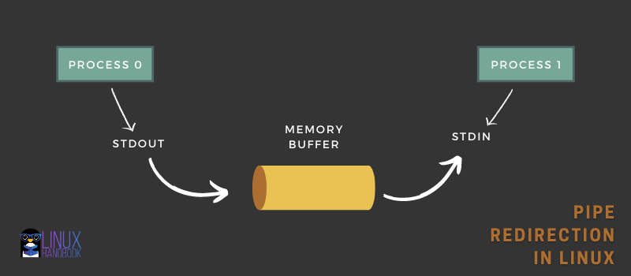

# Pipes and Redirection

## Linux Data Stream

Standard linux data stream:
- STDIN(0): Standard Input
- STDOUT(1): Standard Output
- STDERR(2): Standard Error

## Pipe (`|`)

How pipe works:

- Usage : `<command 1> | <command 2>`
  - Examples:
    - `ls -l | head`: output only the first 10 files from ls output
    - `cat -n var/log/auth.log | grep -a “authentication failure”` : search lines from auth.log that have “authentication failure” line
    - `cat -n var/log/auth.log | grep -a “authentication failure” | wc -l`: 
      - wc -l will count the number of lines, in this case the number of authentication failure from the log file

## Command Redirection

### `>`

- `>`: redirect output to a file instead of in the output stream
  - Examples:
    - `ls -l > ls.txt`
    - (Notes: `tty` will show the current terminal session path)
    - From a terminal session can do `echo “Hello !!!` > <path-to-other-terminal-session>`
  - Case 1: redirected output doesn’t exist -> In this case create file normally
  - Case 2: redirected output exist -> Overwritten the existing file

### `>>`

- `>>`: append the output to a file (instead of overwriting with `>`)
  - Case 1: if file doesn’t exists, create the file then output
  - Case 2: if file exists, append the output to the file

### `2>` and `2>>`

- `2>` and `2>>`: Same as `>` and `>>` but it will output the STDERR instead of STDOUT  
- Example:
  - Output to 2 files (success and error):
    - `tail /etc/passwd /etc/shadow > output.txt > 2> error.txt`: Will output the STDOUT to output.txt and STDERR to error.txt
  - Output both success and error to 1 file
    - `tail -n 2 /etc/passwd /etc/shadow > output.txt 2>&1`: this will output the STDOUT to output.txt and the `>&1` redirects the STDERR to STDOUT so they appear together

### `cut`
- `cut`: Cut selected portion of each line of a file
  - Options
    - `-d` : delimiter (e.g `cut -d : -f 1,7 /etc/passwd` will cut each line by delimiter “:”, then we will retrieved only the 1st and 7th section)

### `tee`
- `tee`: copies output to zero or multiple files. But also output it in the standard output
  - Options
    - `-a`: append the output instead of overwriting (default) to a file
  - Example:
    - ` ls -l | tee ls.txt output.txt`: this will output the data to the standard output, `ls.txt` and `output.txt`

