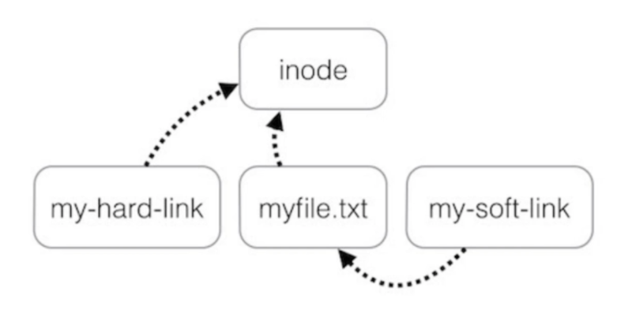

# Hard and Symlinks

## The Inode Structure

- Each file on the disk has a data structure called index node or inode associated with it.
- This structure stores metadata information about the file such as the type, file's permission, file's owner and group owner, timestamp information, file size and so on.
- It actually contains all file information except the file contents and the name.
- To see inode number (is unique) do `ls -i` 
- Can copy the inode by using `ln` command (e.g. ln a.txt b.txt)
- What this will do is making b.txt point to the same inode structure as a.txt (a.txt and b.txt point to the same memory)
- When using `ls -l` , you can see the number of hard links of a.txt is increment by 1
